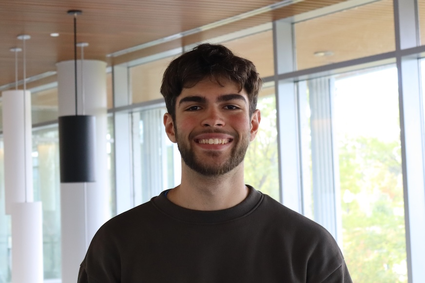

# Understanding Digital Accessibility Project

## *About Me* :pencil2:

My name is George Coulouras, and I am a junior at the University of Massachusetts Amherst pursuing a **dual degree in English and Economics**, as well as a **Certificate in Professional Writing and Technical Communication**. I have had a lifelong passion for writing, which has evolved into an interest in professional writing as a potential career path. 

## *About this Accessibility/Flare project* :computer:
[Link to my project](https://gcoulouras.github.io/HTML5-2.0/Content/Home.htm)

### Team Descriptions
* **Video Transcripts:** Jessica, Meghan, Kalana
* **Closed Captions:** Jane, Zoe, Dylan
* **Audio Description:** Arisa, Mary, Emma
* **Visual Formatting:** Chris, Kate, Ella
* **Visual transition effects:** Jenna, Stacy, Mira
* **Chunking, chapters, on-screen markup:** George, Rylee, Mariya
---
### Tools and Concepts used
* POUR Acronym: asks if content is **P**erceivable, **O**perable, **R**obust, and **U**nderstandable.
* Web Content Accessibility Guidelines (WCAG)
* Americans with Disabilities Act of 1990
* Social model of disability
---
### Process description
Mariya, Rylee, and I took advantage of in-class work periods to draft our team content together. There was also much out-of-class work completed by each team member to stay on track for the final due date. Finally, we used in-class workshop days to receive helpful feedback from our classmates on our team content. 

## *3 quick takeways from this project* :exclamation:
1. Accessible web design benefits everybody, not just users with disabilities.  
2. Consider different types of needs when creating or designing accessible tools, as disability is a spectrum.
3. Get input from people with disabilities for tools or accessibility efforts meant to help them.
